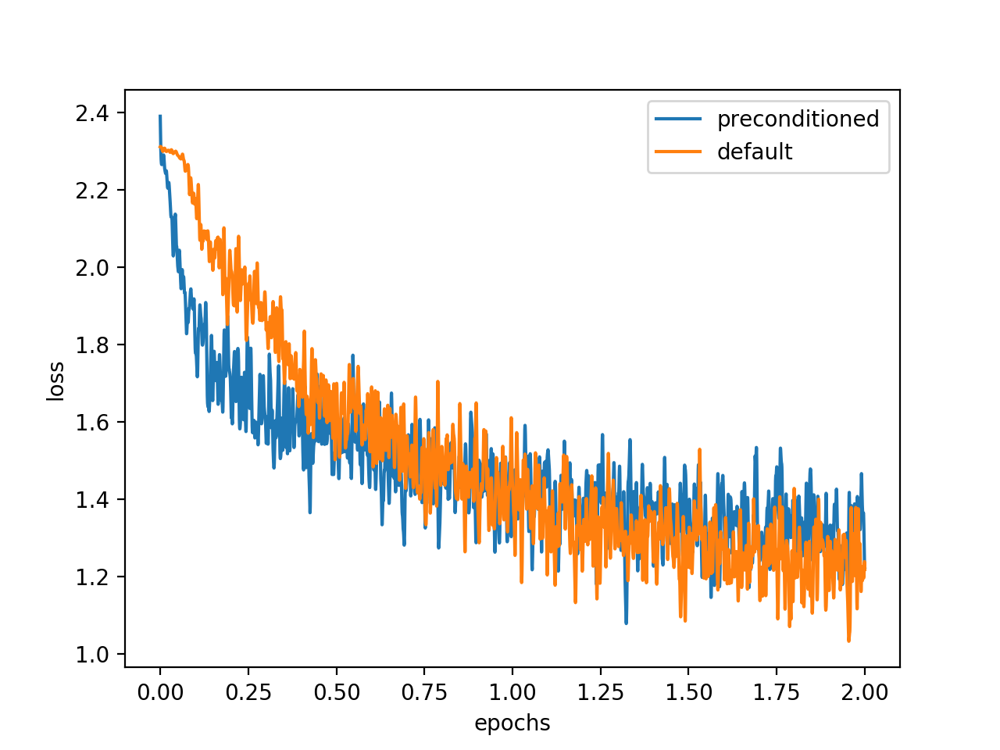

# NN-preconditioners

Exploring preconditioners from statistical considerations - a toy project

## Prerequisites

python3 3.8

pytorch

scipy

matplotlib

pytest

## Usage

This is a demonstration repository. Run the code with

`python3 main.py`.

Run the tests with

`pytest` (needs pytest).

## Background

It is known that network initialization plays a crucial role in how good a network can be trained, especially for deep neural networks [1-3].
Let us assume a normal distributed activation ``a`` is the input to a ``M \times N`` shaped fully connected layer with normal distributed weights of standard deviation ``\sigma``.
The output of the layer will be normal distributed with standard deviation ``\sqrt{M}\sigma``.
It was therefore recommended to initialize a network layer with ``\sigma = \sqrt{M^{-1}}`` e.g. with Normal samples of standard deviation ``\sqrt{M^{-1}}``.
This way standard normal distributed inputs to the layer lead to standard normal distributed outputs.
However the adjoint problem exists for the gradient; a normal distributed gradient that gets backpropagated will be modified by a factor ``\sigma \sqrt{N}``, as was noticed in [2].
Therefore, many initialization, such as the pytorch default initialization for Linear layers [4] do not initialize the weights with a standard deviation of ``\sigma = \sqrt{M^{-1}}``, but choose a tradeoff between fixing the activations and fixing the gradient. 
The situation is further complicated by the presence of non-linearities, which modify the variance of activations and gradients.

For deep networks these factors accumulate multiplicatively and cause the exploding/vanishing gradient problem.
The goal of this toy project is to cancel this effect by introducing a diagonal preconditioner, i.e a diagonal matrix which is multiplied with the gradient before it is applied.
By using a diagonal preconditioner, there is no tradeoff between fixing the variance of the gradient and fixing the variance of the activations, as one has additional degrees of freedom which modifies only the gradient.

## Implementation

To make the effect visible, one needs to consider a fairly deep network. 
Here the network of the pytorch demo was chosen.
There are two training/initialization routines.
The code in `util/default_train.py` mimics the procedure of the official pytorch demo, initializing with the pytorch default initializer and training with a momentum based approach.
The code in `util/static_preconditioned_train.py` initializes all nework layers such that the output is a priori standard normal distributed for normal distributed input.
It computes a diagonal preconditioner that causes the gradient to be standard normal distributed in all layers given a standard normal distributed gradient of the loss.

## Observations

While the preconditioned gradient leeds to faster training initially, the training then slows and it gets overtaken by the standard procedure at the end of epoch 1.
This is possibly due to covariate shifts, all considerations that were made were assuming normal distributed weights of a fixed variance, but as the network trains this variance changes.
Note that the learning rate for the preconditioned training was not tuned, and the overtaking happens later when one adjusts the learning rate.

[1] Glorot, Xavier, and Yoshua Bengio. "Understanding the difficulty of training deep feedforward neural networks." Proceedings of the thirteenth international conference on artificial intelligence and statistics. 2010.
  pages 249-256, 2010

[2] He, Kaiming, et al. "Delving deep into rectifiers: Surpassing human-level performance on imagenet classification." Proceedings of the IEEE international conference on computer vision. 2015.

[3] https://medium.com/@prateekvishnu/xavier-and-he-normal-he-et-al-initialization-8e3d7a087528

[4] https://pytorch.org/docs/stable/_modules/torch/nn/modules/linear.html#Linear
